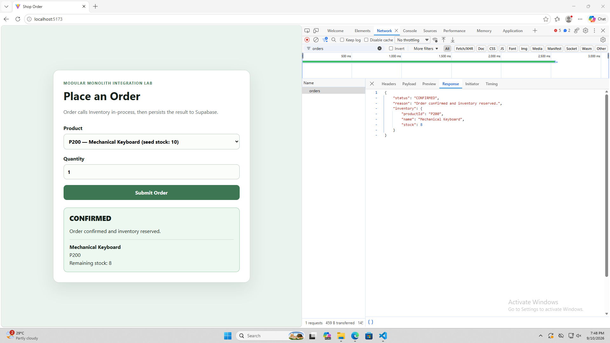
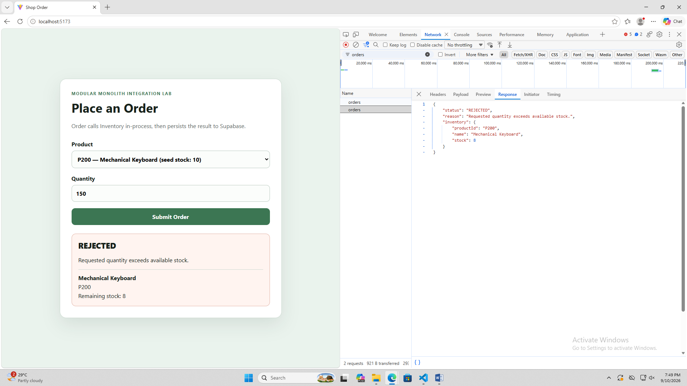
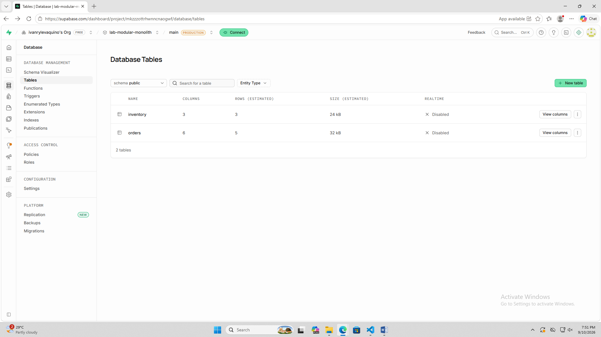
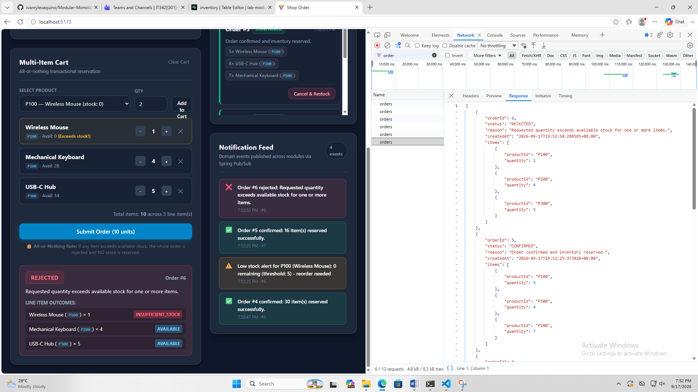
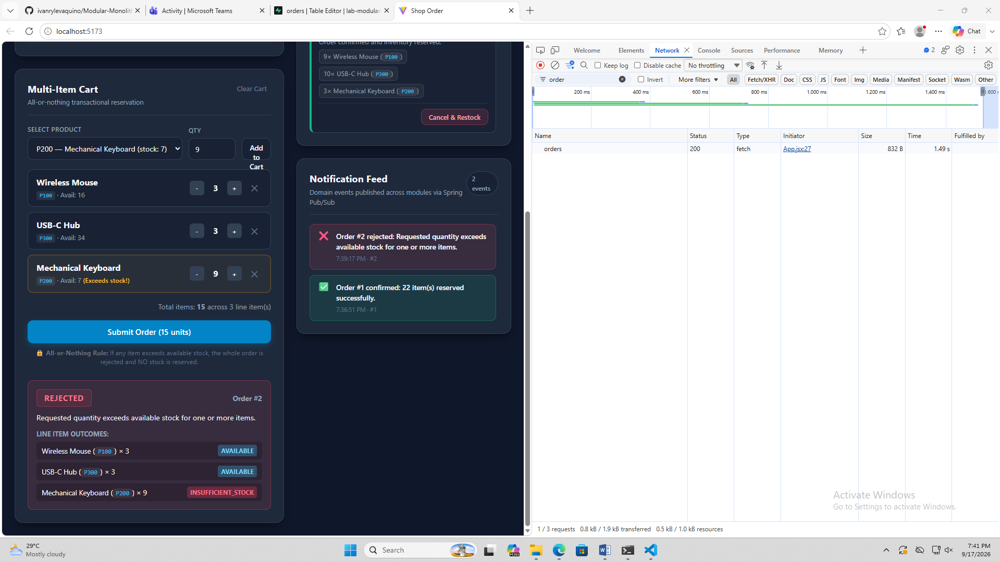

# Modular Monolith Integration --- Lab 2

A single Spring Boot application implementing **Order**, **Inventory**,
and **Notification** modules with in-process integration, shared
Supabase PostgreSQL persistence, and in-process domain events.

## Tech Stack

-   Java 21
-   Spring Boot
-   Spring JDBC
-   PostgreSQL / Supabase
-   React + Vite
-   Maven
-   Spring `ApplicationEventPublisher` / `@EventListener`

## Project Structure

``` text
Modular-Monolith-Integration/
├── backend/
│   ├── pom.xml
│   ├── mvnw
│   ├── mvnw.cmd
│   └── src/
├── frontend/
├── database/
│   └── schema.sql
└── README.md
```

The required module boundaries are:

``` text
edu.cit.aquino.shop
edu.cit.aquino.inventory
edu.cit.aquino.notification
```

`InventoryServiceImpl` remains package-private. The Order module depends
on the Inventory module through the `InventoryService` interface rather
than its implementation.

------------------------------------------------------------------------

## Supabase Setup

1.  Create/open the Supabase project.
2.  Open **Connect** and select the **Session pooler** connection.
3.  Use the database username, password, host, port, and database shown
    by Supabase.
4.  For Spring Boot, the PostgreSQL URL uses the JDBC prefix:

``` text
jdbc:postgresql://<pooler-host>:5432/postgres?sslmode=require
```

5.  Set these environment variables before starting the backend:

``` text
SUPABASE_DB_URL=jdbc:postgresql://<pooler-host>:5432/postgres?sslmode=require
SUPABASE_DB_USERNAME=postgres.<project-ref>
SUPABASE_DB_PASSWORD=<database-password>
```

Do not commit the real password or other credentials.

6.  Recreate the database from the supplied SQL script rather than
    manually editing the Supabase tables:

``` powershell
.\psql.exe "YOUR_CONNECTION_STRING" -f "C:\path\to\Modular-Monolith-Integration\database\schema.sql"
```

The script recreates and seeds:

-   `inventory`
-   `orders`
-   `order_items`
-   `notifications`

Seed inventory:

  Product               ID       Initial Stock
  --------------------- ------ ---------------
  Wireless Mouse        P100                25
  Mechanical Keyboard   P200                10
  USB-C Hub             P300                 0

------------------------------------------------------------------------

## Running the Backend

From `backend` on Windows:

``` powershell
.\mvnw.cmd test
.\mvnw.cmd spring-boot:run
```

The backend runs on:

``` text
http://localhost:8080
```

## Running the Frontend

From `frontend`:

``` powershell
npm install
npm run dev
```

The Vite development server normally runs at:

``` text
http://localhost:5173
```

CORS is configured for the Vite development server.

------------------------------------------------------------------------

## Lab 2 Features

### 1. Multi-item Orders

`POST /api/orders`

Request:

``` json
{
  "items": [
    { "productId": "P100", "quantity": 9 },
    { "productId": "P200", "quantity": 3 },
    { "productId": "P300", "quantity": 10 }
  ]
}
```

Every line item is validated against current stock before any
reservation is attempted. If one line item cannot be fulfilled, the
whole order is rejected and no inventory is reserved.

Successful orders return `CONFIRMED` and line-item outcomes of
`RESERVED`. Rejected orders return `REJECTED` and identify
insufficient-stock items.

The backend transaction and validation-before-reservation design provide
the all-or-nothing behavior required for the lab.

### 2. Cancellation and Restock

``` text
POST /api/orders/{orderId}/cancel
```

A confirmed order can be cancelled once. Each reserved line item's
quantity is returned through `InventoryService.restock()`.

-   Unknown order → `404`
-   Already cancelled → `409`

### 3. Live Inventory and Order History

``` text
GET /api/inventory
GET /api/orders
```

The frontend refreshes inventory and order history after
order/cancellation operations.

### 4. Notification Events

Order processing publishes domain events through Spring's
`ApplicationEventPublisher`:

``` text
OrderPlaced
OrderRejected
```

The Notification module consumes these events with `@EventListener` and
writes notification records to the database.

``` text
GET /api/notifications
```

The Notification module only depends on the event classes. It does not
call OrderService or InventoryService.

### 5. Low-stock Alerts

After a successful reservation, if remaining stock falls below the
configured threshold of `5`, a `LowStockEvent` is published.

The Notification module records a separate reorder-needed notification,
and the frontend highlights low-stock inventory rows.

### Event Processing

The event listeners are **synchronous by default**. `@Async` was not
used because asynchronous processing is unnecessary for this lab and
synchronous listeners make the event-to-notification behavior immediate
and easy to demonstrate within the single deployable application.

------------------------------------------------------------------------

## API Summary

  --------------------------------------------------------------------------------
  Method                  Endpoint                         Purpose
  ----------------------- -------------------------------- -----------------------
  `POST`                  `/api/orders`                    Place a multi-item
                                                           order

  `POST`                  `/api/orders/{orderId}/cancel`   Cancel and restock a
                                                           confirmed order

  `GET`                   `/api/orders`                    Retrieve order history

  `GET`                   `/api/inventory`                 Retrieve current
                                                           inventory

  `GET`                   `/api/notifications`             Retrieve
                                                           notification/event log
  --------------------------------------------------------------------------------

## Network Evidence

The following evidence was captured from the running React application
with the browser's **Network** tab open.

### 1. Multi-item order --- all items succeed

The confirmed-order evidence shows Order #1 containing multiple line
items:

-   P100 × 9
-   P300 × 10
-   P200 × 3

All three items show `RESERVED`, and the response/status is `CONFIRMED`.

**Evidence:** 



### 2. Multi-item order --- one item fails with no partial reservation

The rejected-order evidence shows a multi-item cart containing:

-   P100 × 3 --- available
-   P300 × 3 --- available
-   P200 × 9 --- insufficient stock

The complete order is `REJECTED`, with P200 marked `INSUFFICIENT_STOCK`.
The other items are not reserved.

**Evidence:** 


A later rejected-order response also shows the rejected order containing
multiple line items and the insufficient-stock item:


### 3. Cancellation and restock

The dashboard shows Order #5 in the `CANCELLED` state and the live
inventory table after cancellation. The Network panel also contains the
cancellation request and subsequent inventory/order refresh requests.

**Evidence:** 


### 4. Notification feed --- confirmed, rejected, and low-stock events

The Notification Feed shows:

-   a confirmed order notification,
-   a rejected order notification, and
-   a low-stock alert indicating that remaining stock is below the
    threshold and reorder is needed.

**Evidence:** 


The dashboard also demonstrates the event-driven notification feed
alongside live orders and inventory:

**Additional evidence:**


------------------------------------------------------------------------

## Reflection

### 1. Atomic multi-item orders

The multi-item order flow stays atomic inside the modular monolith
because OrderService validates every line item against current inventory
before making any reservation calls. This prevents the common case where
the first few products are reserved and a later product fails. The order
operation is also transactional, so the database changes made during the
request participate in one transaction. Because Order and Inventory run
inside the same application and share the same database, the application
can use normal transaction management rather than coordinating
independent network calls. If Inventory were extracted into a separate
microservice, a single database transaction could no longer span both
services. I would need a distributed workflow such as a saga, with
compensating actions such as restocking previously reserved items when a
later reservation fails. The system would also need to handle timeouts,
retries, duplicate messages, and partial failures.

### 2. Event-driven Notification coupling

Publishing an event instead of directly calling Notification reduces
coupling between OrderService and Notification. OrderService only knows
that an `OrderPlaced` or `OrderRejected` event exists and does not need
to know how notifications are stored or displayed. Notification can
subscribe to those events independently, and additional consumers could
be added without modifying OrderService. If Notification became a
separate microservice, the in-process Spring event mechanism would need
to be replaced or bridged with a message broker such as RabbitMQ, Kafka,
or another durable messaging system. The design would also need
decisions about delivery guarantees, retries, duplicate-event handling,
ordering, persistence, and what happens when the notification service is
temporarily unavailable.

### 3. Extracting one module

If exactly one module had to be extracted first, I would choose
Notification because it is already event-driven and has no dependency on
OrderService or InventoryService implementations. The main change would
be replacing the in-process `ApplicationEventPublisher`/`@EventListener`
connection with a message broker and explicit event contracts. Order
would publish serialized `OrderPlaced`, `OrderRejected`, and `LowStock`
messages, while Notification would consume them independently and write
to its own database. The frontend's notification endpoint could then
point to the notification service or an API gateway. The Order and
Inventory modules could remain in the original monolith while the
notification boundary is introduced incrementally.

------------------------------------------------------------------------

## Submission Checklist

- [x] Backend source committed
- [x] Frontend source committed
- [x] `database/schema.sql` committed
- [x] README committed
- [x] Real database credentials excluded from Git
- [x] Four Network Evidence scenarios documented
- [x] Screenshots placed under `docs/evidence/`
- [x] Multi-item confirmed order tested
- [x] Multi-item rejected/no-partial-reservation case tested
- [x] Cancellation/restock tested
- [x] Confirmed, rejected, and low-stock notifications visible
- [x] `\.\mvnw.cmd test` passes
- [x] `\.\mvnw.cmd spring-boot:run` works
- [x] `npm run dev` works
- [x] GitHub repository link ready for submission
